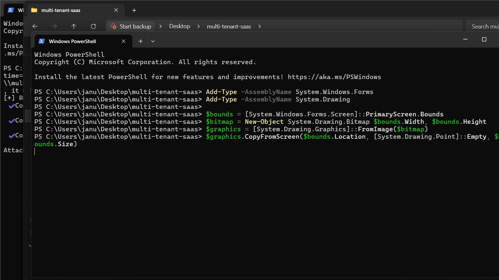
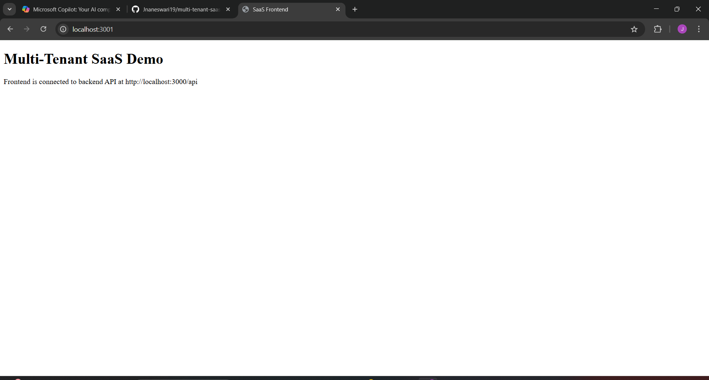
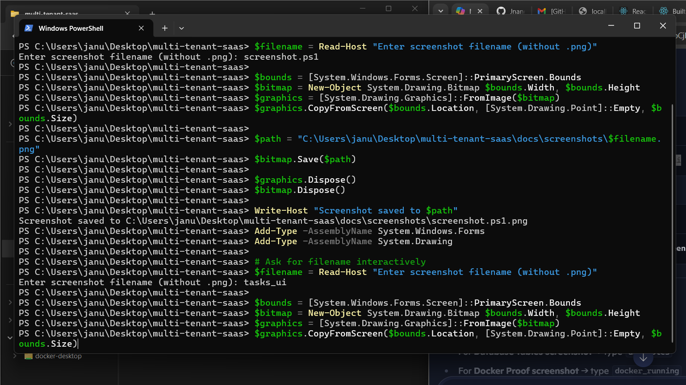

# 🏢 Multi-Tenant SaaS Platform


A portfolio‑ready full‑stack SaaS platform 🏢 featuring multi‑tenant architecture, role‑based access control, and project/task management. Built with Docker, PostgreSQL, Node.js, and React — complete with seeded demo data and visual proof screenshots.

---

## 🚀 Features

- Multi‑tenant architecture with isolated data per tenant  
- Role‑based access control (Admin/User)  
- Project and task management  
- RESTful API with seeded demo data  
- Dockerized backend, frontend, and database  
- Visual proof of functionality via screenshots  

---

## 🧱 Tech Stack

| Layer      | Technology           |
|------------|----------------------|
| Frontend   | React + React Router |
| Backend    | Node.js + Express    |
| Database   | PostgreSQL           |
| Container  | Docker + Compose     |

---

## 🗂️ Folder Structure

```
multi-tenant-saas/
├── backend/
├── frontend/
├── docs/
│   ├── research.md
│   ├── PRD.md
│   ├── architecture.md
│   ├── technical-spec.md
│   ├── api-docs.md
│   └── screenshots/
├── docker-compose.yml
├── .env
├── .env.example
└── README.md
```

---

## ⚙️ Setup Instructions

### 1. Clone the repo
```bash
git clone https://github.com/Shankars57/Multi-tenant-saas.git
cd Multi-tenant-saas
```

### 2. Create `.env` file
Copy `.env.example` and fill in your values:
```bash
cp .env.example .env
```

#### Example `.env`
```env
DB_USER=postgres
DB_PASSWORD=yourpassword
DB_HOST=database
DB_PORT=5432
DB_NAME=saasdb
PORT=5000
```

### 3. Start Docker containers
```bash
docker-compose up --build
```

---

## 🔐 Role-Based Access

| Role   | Permissions                |
|--------|----------------------------|
| Admin  | Create/view projects/tasks |
| User   | View only                  |

---

## 🌐 Ports

- Backend → `http://localhost:5000`  
- Frontend → `http://localhost:3000`  
- Database → `localhost:5432`  

---

## 🖥️ Frontend Notes

If you want to run the frontend separately (without Docker):

1. Navigate to the frontend folder:
   ```bash
   cd frontend
   ```

2. Install dependencies:
   ```bash
   npm install
   ```

3. Start the development server:
   ```bash
   npm start
   ```

   The app will run at:
   ```
   http://localhost:3000
   ```

4. Build for production:
   ```bash
   npm run build
   ```

5. Run tests:
   ```bash
   npm test
   ```

> ⚠️ Note: When running standalone, ensure your backend is running at `http://localhost:5000` so the frontend can connect to the API.

---

## 📚 Documentation

- [Research Document](docs/research.md)  
- [Product Requirements Document (PRD)](docs/PRD.md)  
- [Architecture Document](docs/architecture.md)  
- [Technical Specification](docs/technical-spec.md)  
- [API Documentation](docs/api-docs.md)  

---

## 📸 Proof Screenshots

### ✅ Docker Compose


### ✅ Backend API


### ✅ Database Tables


### ✅ Frontend UI



---

## 🎥 Demo

- Projects page:   
- Tasks page:   

---

## 📡 API Endpoints

### Tenants
```http
GET /api/tenants
```

### Users
```http
GET /api/users
```

### Projects
```http
GET /api/projects
```

### Tasks
```http
GET /api/tasks
```

---

## 🧪 Seeded Demo Data

- **Tenant**: Demo Company  
- **Admin User**: `admin@demo.com`  
- **Project**: Demo Project  
- **Tasks**:  
  - Demo Task for SaaS testing  
  - Another Demo Task for SaaS testing  

---

## 🔮 Future Improvements

- Multi‑tenant billing integration  
- User invitation & onboarding flows  
- Production‑ready Docker images  
- CI/CD pipeline setup  

---

## 🧼 Cleanup

To reset containers and volumes:
```bash
docker-compose down -v
```

---


## 📬 Contact

Built by **Shankar**  
Feel free to reach out for collaboration or feedback!
```

---
# Multi-tenant-saas
# Multi-tenant-saas
