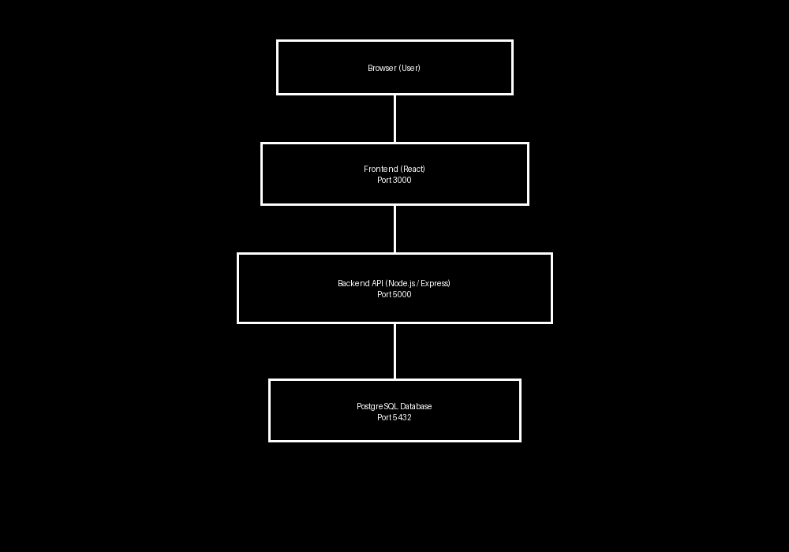
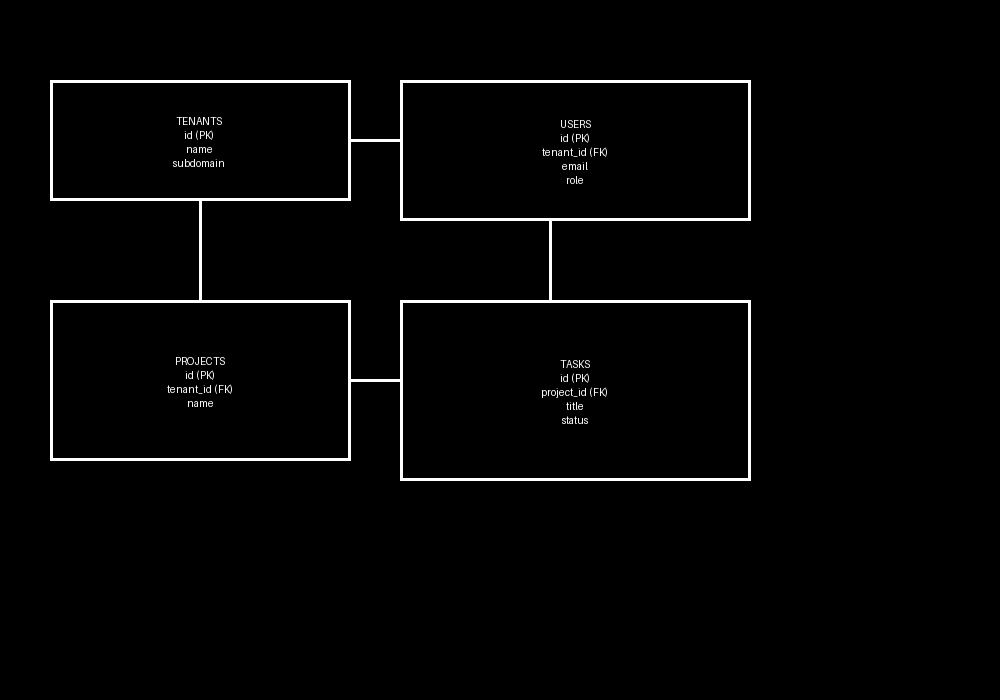

# Architecture Document

## 1. System Architecture Diagram
The system consists of the following components:
- **Client (Browser):** End users access the application via web browsers.
- **Frontend Application (React):** Provides the user interface, handles routing, and communicates with the backend via REST APIs.
- **Backend API Server (Node.js/Express):** Handles business logic, authentication, authorization, and database operations.
- **Database (PostgreSQL):** Stores tenant, user, project, task, and audit log data.
- **Authentication Flow (JWT):** Stateless authentication with role-based access control.

---

## 2. Database Schema Design
The database schema includes the following tables:
- **tenants**
  - Stores organization information
- **users**
  - Stores user accounts with tenant association
- **projects**
  - Stores projects for each tenant
- **tasks**
  - Stores tasks within projects
- **audit_logs**
  - Tracks important actions for security audit
- **sessions (optional)**
  - Tracks active user sessions if implemented

Relationships:
- Tenants → Users (1:N)
- Tenants → Projects (1:N)
- Projects → Tasks (1:N)
- Users → Tasks (assigned_to relationship)
- Audit Logs → Users/Tenants

---

## 3. API Architecture
The system exposes RESTful APIs organized by modules:

### Authentication
- `POST /api/register` → Register new tenant
- `POST /api/login` → Authenticate user
- `POST /api/logout` → Logout user
- `GET /api/health` → Health check endpoint

### Tenants
- `GET /api/tenants` → List tenants (Super Admin only)
- `GET /api/tenants/:id` → Get tenant details
- `POST /api/tenants` → Create tenant
- `PUT /api/tenants/:id` → Update tenant
- `DELETE /api/tenants/:id` → Delete tenant

### Users
- `GET /api/users` → List users (Tenant Admin only)
- `GET /api/users/:id` → Get user details
- `POST /api/users` → Create user
- `PUT /api/users/:id` → Update user
- `DELETE /api/users/:id` → Delete user

### Projects
- `GET /api/projects` → List projects
- `GET /api/projects/:id` → Get project details
- `POST /api/projects` → Create project
- `PUT /api/projects/:id` → Update project
- `DELETE /api/projects/:id` → Delete project

### Tasks
- `GET /api/tasks` → List tasks
- `GET /api/tasks/:id` → Get task details
- `POST /api/tasks` → Create task
- `PUT /api/tasks/:id` → Update task
- `DELETE /api/tasks/:id` → Delete task

### Notes
- All APIs return consistent response format: `{ success, message, data }`
- Role-based access enforced at API level
- Proper HTTP status codes used (200, 201, 400, 401, 403, 404, 409)
